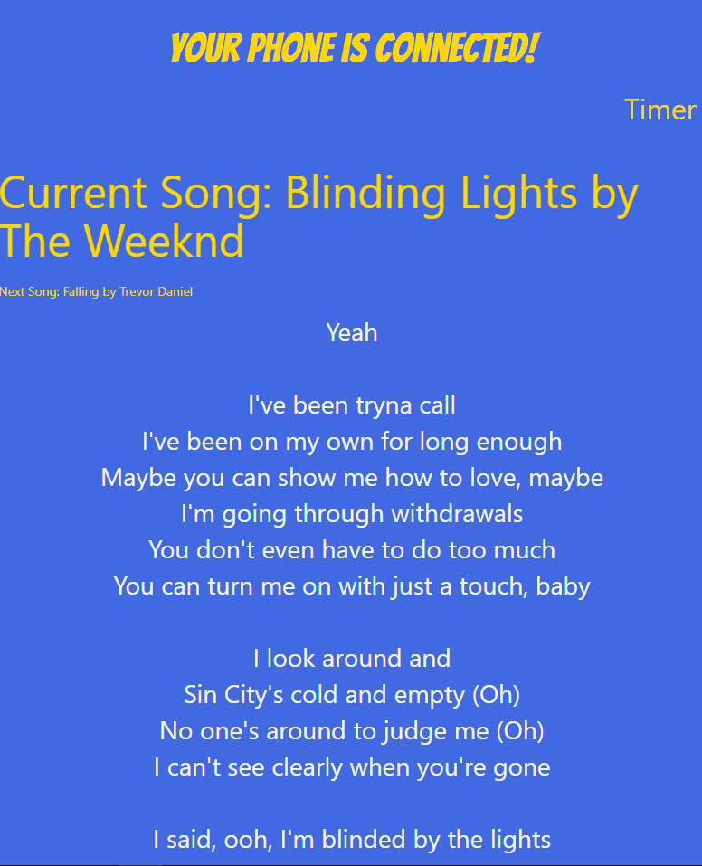

# teamdbs

## Project title
Best Karaoke 

## User story

 As a person who wants to sing I want to pull up songs on Spotify,    
 so that Musixmatch can take those songs and retrieve lyrics,  
 so that I can sing to my favorite songs.   

 Acceptance Criteria:    
 Given I'm a person who wants to sing    
 When I pull up a song on Spotify    
 Then I should see lyrics to sing to  

 ## Extensions Needed
Moesif Origin & CORS Changer:  
http://bit.ly/CORSFix

## Screenshots 
  
  

## APIs to be used
- Spotify
- Genius Lyrics

### Rough breakdown of tasks
- Front End - Samantha  
- Back End - Brandon  
- Project Manager - David  
